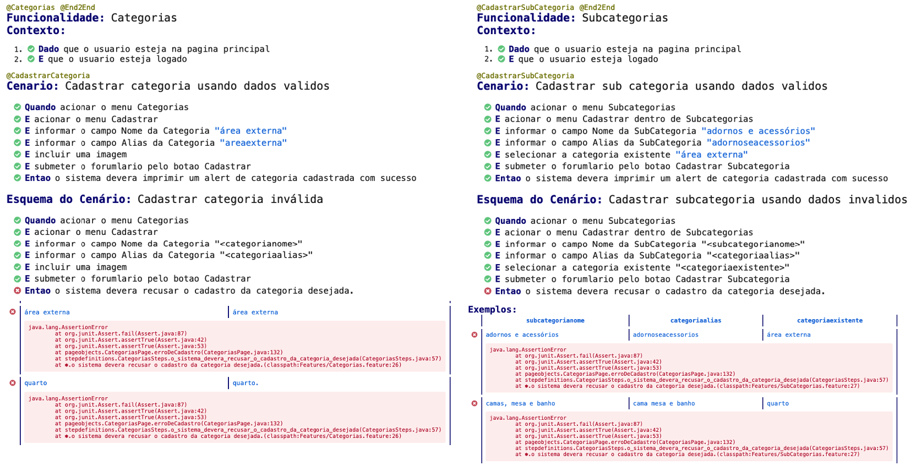

<h1 align="left"> Teste - Vitrine CasaPark  </h1>

Este projeto foi idealizado no intuito de pôr em prática os conhecimentos adquiridos em relação ao **Teste End2End**, isto é, com foco nas ações visíveis ao usuário, atravessando todas as camadas de arquitetura do sistema, para fins de identificar possíveis problemas na aplicação.

Para fins de avaliar se a aplicação estava se comportando como esperado do início ao fim, utilizou-se o framework **JUnit** no desenvolvimento e execução de testes em código **Java,** com o uso do **Selenium** na realização de testes da interface web da aplicação e o **Cucumber** na execução de testes automatizados escritos em um estilo de desenvolvimento orientado a comportamento (BDD).

Todo este processo contou com a IDE do **Eclispe** e o uso do **Maven** para a compilação do código e o armazenamento de dependências em um arquivo pom.xml, além de outras ferramentas mencionadas abaixo.

<h2> 🛠 Ferramentas usadas para o Teste E2E</h2>

<h2> 🛠 Bibliotecas</h2>

As principais bibliotecas utilizadas neste projeto foram:

- Webdrivermanager, para download e configuração do driver do Selenium.
- Cucumber, para a criação de dashboard de resultado de testes.

<h2> 🛠 Executar os Testes</h2>

Para executar os testes, pela IDE de sua preferência, basta fazer um git clone do projeto e executar o arquivo TestRunner.java que iniciará todos os testes. Para o uso adequado dos testes, será necessário ainda rodar a aplicação do Vitrine CasaPark em localhost, na porta 3001.

<h2> 🛠 Relatório de Testes</h2>

Ao executar os testes, os relatórios HTML estão sendo gravados dentro do diretório _target/cucumber-reports/._ No report HTML, está registrada a execução dos casos de testes, juntamente a evidências de sucesso/falha nos testes executados, incluindo arquivos de imagem no formato jpg sobre os resultados apurados. Estes últimos, relacionados a imagens, estão salvos no diretório screenshots

<h2> 🛠 Sobre os Resultados dos Testes</h2>

Devido a natureza do desafio, convém destacar os 2 principais erros encontrados no sistema:

- **Registro duplicado de categorias e subcategorias**. Ao cadastrar uma categoria ou subcategoria, o sistema não verifica se esta já foi registrada anteriormente, gerando categorias repetidas. Considerei como um erro, pois para cada produto há apenas uma referência a uma categoria ou a uma subcategoria.
- **Registro de alias com espaço, acentuação ou caractere especial**. Ao cadastrar uma categoria ou subcategoria o sistema libera o uso de alias com espaço, acentuação ou caractere especial. Considerei como um erro, pois o alias está sendo utilizado nesta aplicação como trecho de url e não era o comportamento esperado pelo desenvolvedor o uso de tais caracteres, com risco na quebra de link de referência a categoria ou subcategoria.

<h2> 🛠 Considerações Finais</h2>

O projeto trouxe em si vários desafios, pois o objetivo principal era justamente encontrar, da forma mais performática possível, o maior número de erros, falhas ou bugs na aplicação testada. E, claro, na medida que o conhecimento vai sendo aprimorado este ideal se torna cada vez mais rigoroso, necessitando de ajustes na linguagem, com intuito de entregar um código cada vez mais limpo e adequado ao Teste.

Pelo trabalho desenvolvido, verificou-se ainda a necessidade de aproximar cada vez mais desenvolvedores e testadores a trabalharem em conjunto, num modo de técnica para desenvolvimento ágil conhecida como **Behaivour Driven Development (BDD)**, a qual foca no comportamento do software e melhora a comunicação entre as equipes refinando os conhecimentos para entregar ao Cliente e Usuário Final um código de boa qualidade, alta coesão e com número reduzido de bugs, proporcionando um prazo de validade longo e manutenções mais baratas no futuro.

Durante este desafio, coloquei alguns conhecimentos a prova, de linguagem programação em **JAVA** até a construção de cenários pelo **Cucumber** no uso de desenvolvimento orientado a comportamento (**BDD**), ao modo como funciona a arquitetura de classes no **JUnit**, pela coleção de dependências documentadas pelo **Maven** em seu arquivo pom.xml até a criação de testes funcionais pelo **Selenium** com o **WebDriver**, entre outros muitos conhecimentos já adquiridos.

Em resumo, me sinto ansioso para o próximo trabalho em teste, do qual pretendo aperfeiçoar ainda mais estes e outros estudos.
